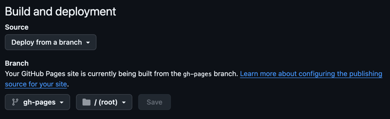

This project was created with [Instant Compose](https://github.com/EmilFlach/instant-compose), built on top of [composables-cli](https://github.com/composablehorizons/composables-cli) by Alex Styl.

## Get Started

Run the app
```shell
./gradlew :dev:run
```

## Share your app on Github
1. Push your project to a **public** Github repository
2. Wait 10-15 minutes for the Github action to complete
3. Open the `settings` > `pages` of your Github repository
4. Select the `gh-pages` in the list of branches and press save
   
5. Wait 5 minutes for the Github action to complete
6. Your app is now live at <your_username>.github.io/<your_repo_name>
   * For example: https://emilflach.github.io/instant-compose-example/
7. Optional: create a PR and receive a preview link as a comment on the PR. 